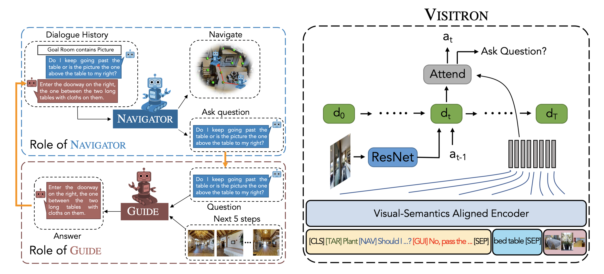

# VISITRON: Visual Semantics-aligned Interactively Trained Object-Navigator

[VISITRON: Visual Semantics-aligned Interactively Trained Object-Navigator](https://arxiv.org/abs/2105.11589)

Ayush Shrivastava, Karthik Gopalakrishnan, Yang Liu, Robinson Piramuthu, Gokhan Tür, Devi Parikh, Dilek Hakkani-Tür

Accepted to NAACL 2021, Visually Grounded Interaction and Language (ViGIL) Workshop




## Setup
Clone the repo using:
```
git clone --recursive https://github.com/alexa/visitron.git
```

### Matterport3D dataset and simulator
This codebase uses the [Matterport3D Simulator](https://github.com/peteanderson80/Matterport3DSimulator). Detailed instructions on how to setup the simulator and how to preprocess the Matterport3D data for faster simulator performance are present here: [Matterport3DSimulator_README](https://github.com/mmurray/cvdn/blob/master/README_Matterport3DSimulator.md). We provide the docker setup for ease of setup for the simulator.

We assume that the Matterport3D is present at `$MATTERPORT_DATA_DIR` which can be set using:
```
export MATTERPORT_DATA_DIR=<PATH_TO_MATTERPORT_DATASET>
```

### Docker setup

Build the docker image:
```
docker build -t mattersim:visitron .
```

To run the docker container and mount the codebase and the Matterport3D dataset, use:
```
nvidia-docker run -it --ipc=host --cpuset-cpus="$(taskset -c -p $$ | cut -f2 -d ':' | awk '{$1=$1};1')" --volume `pwd`:/root/mount/Matterport3DSimulator --mount type=bind,source=$MATTERPORT_DATA_DIR,target=/root/mount/Matterport3DSimulator/data/v1/scans,readonly mattersim:visitron
```

### Task data setup
VISITRON is pretrained on [NDH](https://github.com/mmurray/cvdn) and [R2R](https://github.com/peteanderson80/Matterport3DSimulator/tree/master/tasks/R2R), and then finetuned on NDH and [RxR](https://github.com/google-research-datasets/RxR). Download these task data as follows.

#### NDH, R2R data :

```
mkdir -p srv/task_data
bash scripts/download_ndh_r2r_data.sh
```

#### RxR data :

Refer to [RxR repo](https://github.com/google-research-datasets/RxR#dataset-download) for its setup and copy the data to `srv/task_data/RxR/data` folder.


### Pretraining data

Inside the docker container, run these commands to generate pretraining data.

For NDH, run
```
python scripts/generate_pretraining_data.py --dataset_to_use NDH --split train
```
For R2R, run
```
python scripts/generate_pretraining_data.py --dataset_to_use NDH --split train
```
The data gets saved to `srv/task_data/pretrain_data`.
By default, this script starts 8 multiprocessing threads to speed up its execution. `--start_job_index`, `--end_job_index` and `--global_total_jobs` can be changed to change the number of threads.


### Image features

Our pretraining approach requires object-level features from Faster RCNN concatenated with orientation features.

First, follow the setup from the [bottom-up attention repo](https://github.com/peteanderson80/bottom-up-attention) inside a docker container to install Caffe. Note that the code from bottom-up attention repo requires python2.

Then, extract object-level features using
```
python2 scripts/precompute_bottom-up_features.py
```
You can use `--gpu_id` to parallelize the feature extraction process ovewr multiple GPUs.

Then, to concatenate orientation features to object-level features, use
```
python scripts/add_orientation_to_features.py
```

Here are the extracted object-level features in pickle format. We stored the features in lmdb format for fast loading.
#TODO: Add extracted features here.

During finetuning, we use scene-level ResNet features. Download [ResNet features](https://github.com/peteanderson80/Matterport3DSimulator#precomputing-resnet-image-features) from [this link](https://www.dropbox.com/s/o57kxh2mn5rkx4o/ResNet-152-imagenet.zip?dl=1). You can also extract using
```
python scripts/precompute_resnet_img_features.py
```


### Oscar setup
We use [Oscar](https://github.com/microsoft/Oscar) model as the backbone for our VISITRON model. Copy the Oscar pretrained weights using
```
wget https://biglmdiag.blob.core.windows.net/oscar/pretrained_models/$MODEL_NAME.zip
unzip $MODEL_NAME.zip -d srv/oscar_pretrained_models/
```
where `$MODEL_NAME` is `base-vg-labels` and `base-no-labels`.

### Misc
Copy the [timer script](https://github.com/rbgirshick/fast-rcnn/blob/b612190f279da3c11dd8b1396dd5e72779f8e463/lib/utils/timer.py) to `scripts` folder.

## Training

We provide pretraining, training and evaluation scripts in `run_scripts/`.

As an example, use the following command to run a script.

```
bash run_scripts/viewpoint_train/pretrain_ndh_r2r.sh $MODE
```
where `$MODE` can be from [`cpu`, `single-gpu`, `multi-gpu-dp`, `multi-gpu-ddp`].
- Use `cpu` to train on CPU.
- Use `single-gpu` to train on a single GPU.
- Use `multi-gpu-dp` to train on all available GPUs using DataParallel.
- Use `multi-gpu-ddp` to train on 4 GPUs using DistributedDataParallel. Change `--nproc_per_node` in the script to specify no. of GPUs in DistributedDataParallel mode.

Pretraining scripts are in `pretrain`, training scripts which use viewpoint selection as action space are in `viewpoint_train`, turn based action space scripts are in `turn_based_train` and scripts for training and evaluating question-asking classifier are in `classifier`. `ablations` are the training scripts for Table 1 from the paper.

To pretrain our model on NDH and R2R, and finetune on NDH and RxR for viewpoint selection action space, run

1. Pretrain on NDH+R2R for all objectives:
```
bash run_scripts/pretrain/pretrain_ndh_r2r.sh multi-gpu-ddp
```

2. Pick the best pretrained checkpoint by evaluating using
```
bash run_scripts/pretrain/pretrain_ndh_r2r_val.sh multi-gpu-ddp
```

Change `--model_name_or_path` in `run_scripts/viewpoint_train/pretrain_ndh_r2r.sh` to load the best pretrained checkpoint.

3. Finetune on NDH + RxR using
```
bash run_scripts/viewpoint_train/pretrain_ndh_r2r.sh multi-gpu-ddp
```

4. Evaluate trained models using
```
bash run_scripts/viewpoint_train/pretrain_ndh_r2r_val.sh multi-gpu-ddp
```

You can then, run the scripts in `run_scripts/classifier` to train the question-asking classifier.

For any run script, make sure these arguments refer to correct paths, `img_feat_dir`, `img_feature_file`, `data_dir`, `model_name_or_path`, `output_dir`.


## License

This library is licensed under the MIT-0 License. See the LICENSE file.

## Citation:
```
@inproceedings{visitron,
  title={VISITRON: Visual Semantics-aligned Interactively Trained Object-Navigator},
  author={Ayush Shrivastava, Karthik Gopalakrishnan, Yang Liu, Robinson Piramuthu, Gokhan T\"{u}r, Devi Parikh, Dilek Hakkani-T\"{u}r},
  booktitle={NAACL 2021, Visually Grounded Interaction and Language (ViGIL) Workshop},
  year={2021}
}
```


